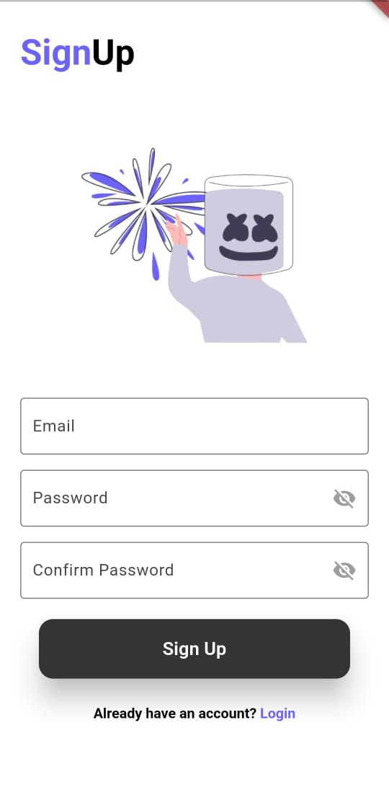
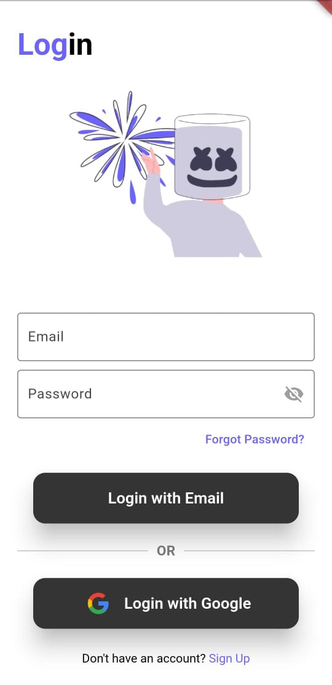
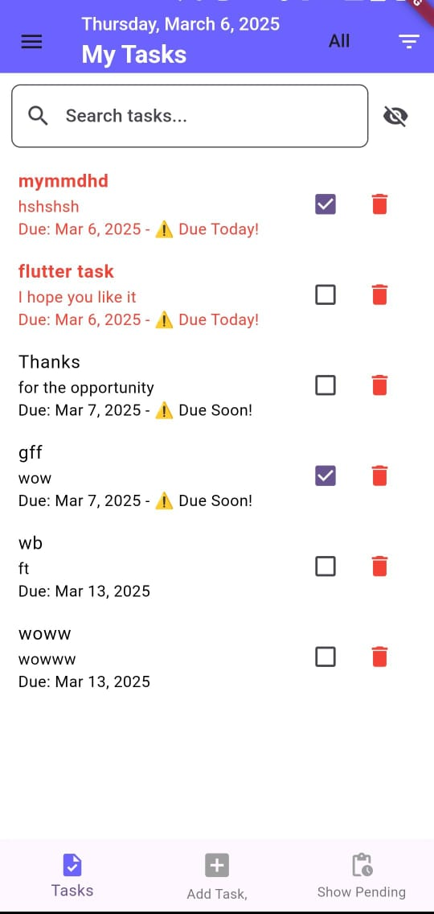

# whatBytesTask

A new Flutter project using **Firebase** as the backend and following the **MVVM architecture** for clean and maintainable code.

## Screenshots

  
  
  

## Getting Started

This project is a starting point for a Flutter application.

### Tech Stack:
- **Flutter** for the frontend  
- **Firebase** for backend services (Authentication, Firestore, etc.)  
- **MVVM architecture** for clean, scalable, and maintainable code  

A few resources to get you started if this is your first Flutter project:

- [Lab: Write your first Flutter app](https://docs.flutter.dev/get-started/codelab)
- [Cookbook: Useful Flutter samples](https://docs.flutter.dev/cookbook)

For help getting started with Flutter development, view the
[online documentation](https://docs.flutter.dev/), which offers tutorials,
samples, guidance on mobile development, and a full API reference.
